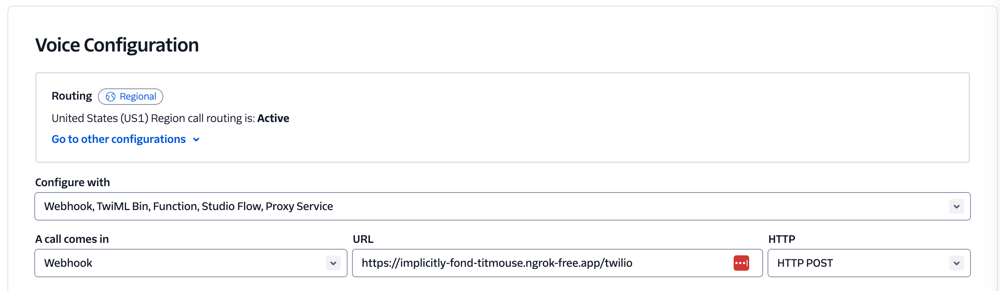

# Simple Chatbot


This app connects you to a chatbot powered by GPT-4, complete with animations generated by Stable Video Diffusion.

See a video of it in action: https://x.com/kwindla/status/1778628911817183509

And a quick video walkthrough of the code: https://www.loom.com/share/13df1967161f4d24ade054e7f8753416

ℹ️ The first time, things might take extra time to get started since VAD (Voice Activity Detection) model needs to be downloaded.

## Get started

```python
poetry install
```

## Run the server

```bash
# No reload
poetry run python src/server.py

# Auto-reload
poetry run python src/server.py --reload
```

## Join the meeting room

### Daily UI

Then, you can visit `http://localhost:7860/start` in your browser to start a chatbot session. However, note that this can create 2 rooms due to the redirect functionality.

Alternatively, CURL `http://localhost:7860/start` in your terminal and then visit the resulting link:

```bash
curl http://localhost:7860/start

# Return to `python server.py` tab
# !!! Creating room
# !!! Room URL: https://tryelixir.daily.co/iwOgRsA1pcq1mkMaxVaM
```

### Twilio

This chatbot is also hooked up to Twilio via [SIP](https://www.twilio.com/docs/voice/api/receiving-sip).

Expose the server to the internet via ngrok. Note that this is a persistent ngrok domain that may cause issues if run by multiple people. To avoid collisions, we can spin up Twilio numbers as needed and configure the webhook URL.

```bash
ngrok http --domain=implicitly-fond-titmouse.ngrok-free.app 7860
```

The webhook url should be `{YOUR_NGROK_URL}/twilio`.



Then, call the configured number. `(510) 619-2831` is the default number that has been configured with `implicitly-fond-titmouse.ngrok-free.app`.
